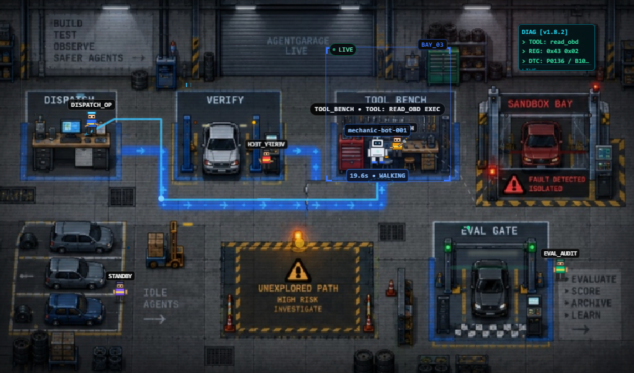

# AgentGarage

Behavioural coverage for AI agents.



Autonomous agents pick tools in a loop and branch on what they observe. They often run with broad permissions and thin guardrails. Normal tests cover a slice of the paths they can reach.

AgentGarage maps which behaviours an agent has exercised, finds reachable state–action pairs it never took, predicts outcomes on those paths, ranks which predictions deserve a sandbox, replays the risky ones against the **real** agent in isolation, and keeps confirmed failures as permanent evals.

A predicted failure is a hypothesis until the real agent reproduces it. The model never decides pass or fail.

**Live demo:** https://main.d34rv48johwdk6.amplifyapp.com  
**Repo:** https://github.com/Syed-Suhaan/AgentGarage

---

## Status pipeline

| Status | Meaning |
|---|---|
| **Observed** | Ran in production / demo traffic; redacted trace stored |
| **Predicted** | Outcome guessed on an unexplored state–action pair |
| **Verified** | Real agent reproduced the failure in an isolated sandbox |
| **Protected** | Compiled to a permanent YAML eval; re-run on new versions |

Only a code verifier moves Predicted → Verified.  
Only the eval compiler (given a failed rule log) moves Verified → Protected.

---

## How it works

```
Agent (Strands / BYO)
  │ OTLP
  ▼
ECS Collector → Kinesis → redact_fn
  → S3 traces + DynamoDB sessions
  → Graph builder → Neptune (behaviour graph)
  → Unexplored path scan
  → Bedrock Nova (trajectory / path finder) → Predicted
  → Jev (TypeSafe AI) ranks scenarios
  → Step Functions → AgentCore Runtime microVM (real agent + fault)
  → Verifier Lambda (code invariants) → Verified
  → Eval compiler → Protected YAML on S3
  → Amplify dashboard (Cognito + API Gateway)
```

### Trust split

- World-model step **proposes**. It cannot write evals.
- AgentCore **executes** the agent in a Firecracker microVM (VPC, no internet). It cannot write evals.
- Verifier Lambda **alone** promotes Predicted → Verified.
- Eval compiler **alone** promotes Verified → Protected.
- Lambdas never run agent code. Only AgentCore does.

We planned a dedicated world-model API. We could not secure a key in time for the hackathon, so **Amazon Bedrock (Nova)** stands in as an LLM trajectory / path finder for the Predicted step. **Jev** ranks which Predicted scenarios get a sandbox first.

---

## Demo agent

Public demo: autonomous **AWS SRE remediator** for a checkout service.

Tools: `get_service_health`, `query_service_logs`, `get_deployment_history`, `rollback_deployment`, `verify_service`.

Planted bug (v1.8.2): after a rollback timeout, the agent retries without an `operation_token` / recheck and double-rollbacks past last-known-good. That path goes Unexplored → Predicted → Verified → Protected. Fix the agent, re-run the eval, pass.

Judge walkthrough: [`docs/demo.md`](docs/demo.md)

---

## AWS

### Build

| Tool | Role |
|---|---|
| AWS CDK (Python) | Full customer one-click package (`cdk/`) |
| AWS SAM + CloudFormation | Live team demo (`infra/demo/`) |
| Amplify Hosting | Next.js dashboard |
| GitHub Actions | Demo CI/CD on push to `main` |
| Strands Agents | Reference SRE agent |

### Ship

Amplify · Cognito · API Gateway · Lambda · Step Functions · EventBridge · S3 · DynamoDB · Neptune Serverless · Bedrock (Nova) · Bedrock AgentCore Runtime · Kinesis · ECS Fargate · ECR · Secrets Manager · CloudWatch · KMS · VPC

API / data plane: **ap-south-2**. Amplify UI: **us-east-1** (Amplify unavailable in ap-south-2).

---

## Repo layout

```
agent/          Reference Strands SRE agent
agentcore/      AgentCore Runtime container contract
services/       Lambda workers (api, collector, graph, simulate, rank, replay, evals)
web/            Next.js dashboard (Amplify)
cdk/            Customer CDK package (not day-to-day demo deploy)
infra/demo/     SAM + Amplify live demo stacks
schemas/        Shared schemas / templates
benchmarks/     Competitive harness
docs/           Architecture, demo, CDK, CI/CD
scripts/        Deploy helpers (e.g. Amplify zip + CloudFront invalidate)
```

---

## Docs

| Doc | What |
|---|---|
| [`docs/overview.md`](docs/overview.md) | Product thesis |
| [`docs/architecture.md`](docs/architecture.md) | Services + 10-step flow |
| [`docs/demo.md`](docs/demo.md) | Judge demo script |
| [`docs/cdk.md`](docs/cdk.md) | Full stack deploy |
| [`docs/cicd.md`](docs/cicd.md) | Live demo via GitHub Actions |
| [`docs/ui.md`](docs/ui.md) | Dashboard notes |
| [`docs/ORCHESTRATOR.md`](docs/ORCHESTRATOR.md) | Demo vs CDK lock |

---

## Deploy

**Live team demo** (default): SAM + Amplify via GitHub Actions. Do **not** `cdk deploy` for day-to-day shipping.

See [`docs/cicd.md`](docs/cicd.md) and [`infra/demo/README.md`](infra/demo/README.md).

**Customer one-click package:** [`cdk/`](cdk/) — `mode=demo` or `mode=private`. See [`docs/cdk.md`](docs/cdk.md) and [`cdk/README.md`](cdk/README.md).

Private mode BYO agent: any OTLP-emitting agent; register ECR image for AgentCore sandbox:

```bash
cdk deploy -c mode=private -c agentImageUri=ACCOUNT.dkr.ecr.REGION.amazonaws.com/your-agent:tag
```

Image must expose `GET /ping` and `POST /invocations` on port 8080 (`linux/arm64`). Details in [`agentcore/`](agentcore/) and [`docs/architecture.md`](docs/architecture.md).

---

## Local web (optional)

```bash
cd web
npm ci
npm run build   # static export → web/out
```

Point `NEXT_PUBLIC_API_URL` / Cognito env vars at a deployed demo stack (see `infra/demo` / Amplify env).

---

## Team

Built for the WeMakeDevs × AWS hackathon.

| | WeMakeDevs | GitHub |
|---|---|---|
| Syed Suhaan | suhaan | [Syed-Suhaan](https://github.com/Syed-Suhaan) |
| Riteesh | riteesh | [Riteesh-indumuri](https://github.com/Riteesh-indumuri) |
| Dhanvin | dhanvin37 | [dhanvin-ai](https://github.com/dhanvin-ai) |
| Rishi | raghavarajurishi | [raghavarajurishi](https://github.com/raghavarajurishi) |
